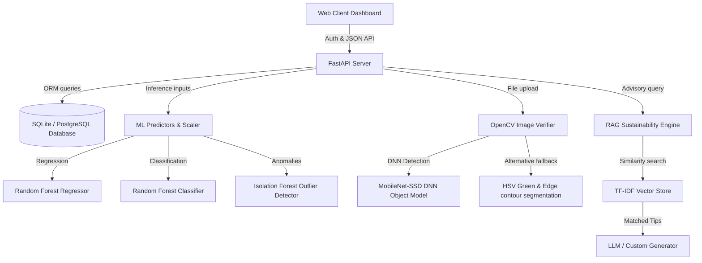

# 🍃 GREENIFY

Greenify is a production-ready, full-stack machine learning web application designed to track, predict, and reduce individual carbon emissions based on daily activities and lifestyle patterns. 

The application features secure user authentication, real-time ML-powered carbon footprint calculations, anomaly detection, CV-based activity verification, RAG-based sustainability recommendations, global leaderboards, achievement badge rewards, and downloadable analytical reports.

---

## 🏗️ Architecture & Technical Stack



### Stack Components:
- **Backend Framework**: FastAPI (Python) - High performance, asynchronous endpoints, auto-generated Swagger UI docs.
- **Database**: SQLite (SQLAlchemy ORM) - Simple out-of-the-box local setup, switchable to PostgreSQL by updating `DATABASE_URL` in `.env`.
- **Machine Learning**: Scikit-Learn, Pandas, NumPy, Joblib - RandomForest Regressor (footprint math), RandomForest Classifier (impact bands), and Isolation Forest (anomalous input flagger).
- **Computer Vision**: OpenCV (Caffe MobileNet-SSD Deep Learning + classical HSV contours) - Automatically validates uploading eco-friendly photos (bicycles, public transport vehicles, reusable bottles, tree planting).
- **RAG recommendation**: Scikit-Learn TF-IDF, Cosine Similarity, JSON tips catalog, OpenAI/Gemini APIs (or high-fidelity offline template-driven fallback).
- **Frontend Dashboard**: HTML5, Vanilla CSS3 (Custom Glassmorphism styling, responsive layouts, grid animations), Chart.js (interactive breakdown doughnut charts and trend line charts).

---

## ⚡ Setup & Local Running

### Prerequisites
- **Python 3.12+**
- **pip** (Python package manager)

### Step 1: Install Python Dependencies
From the repository root directory, run:
```bash
pip install -r backend/requirements.txt
```

### Step 2: Pre-train the Machine Learning Models
Generate synthetic logs, fit scaler, regressor, classifier, and outlier models:
```bash
python backend/app/ml/train.py
```

### Step 3: Run the FastAPI Unified Server
Start the development server:
```bash
uvicorn backend.app.main:app --reload --host 127.0.0.1 --port 8000
```

### Step 4: Access the Dashboard
Open your browser and navigate to:
```
http://127.0.0.1:8000/
```
The FastAPI backend serves the frontend SPA natively (redirecting from `/` to `/login.html` and serving all CSS, JS, and image assets from the directory).

- **Interactive API Swagger Docs**: Access [http://127.0.0.1:8000/docs](http://127.0.0.1:8000/docs) to test backend REST endpoints.

---

## 🐳 Running with Docker

You can spin up the entire application, database, and asset folder in a containerized Docker container:

### Build and Run with Docker Compose
From the repository root:
```bash
docker-compose up --build
```
This command builds the Debian slim image, automatically runs the ML training script during build, maps local directories to persist database states and image uploads, and serves the app on [http://localhost:8000/](http://localhost:8000/).

---

## 📡 REST API Documentation

### 1. Authentication
* `POST /api/auth/register`: Signup a new user. Required: `username`, `email`, `password`.
* `POST /api/auth/login-json`: Login via JSON. Returns a JWT token.
* `GET /api/auth/me`: Fetch current logged-in user credentials and points.

### 2. Carbon Log Tracking
* `POST /api/carbon/predict`: Calculate values without logging (for calculators).
* `POST /api/carbon/log`: Commit daily log, run regressor calculations, flag anomalies, update badges, and award reward points.
* `GET /api/carbon/history`: Retrieve history of logs.
* `GET /api/carbon/analytics`: Fetch aggregated category footprints (Chart.js doughnut data) and daily offsets trend (Chart.js line graph).
* `GET /api/carbon/download-report`: Download the user's entire history as a CSV file.

### 3. OpenCV Verification
* `POST /api/verify/upload`: Upload JPEG/PNG activity photos (form fields: `file`, `activity_type`). Runs OpenCV object/color match. If verified, awards `+50 points` and draws emerald bounding labels.
* `GET /api/verify/history`: Retrieve verification upload histories.

### 4. RAG Recommendation Advisor
* `GET /api/recommendations/get`: Query the semantic tips catalog. If a custom query is passed (e.g. `?query=save+gas`), returns matched tips. Otherwise, parses the user's latest logged activities to determine the highest emission source and matches tips against it.

### 5. Gamification
* `GET /api/gamification/leaderboard`: Rank users globally by points.
* `GET /api/gamification/badges`: List available and unlocked badges.
* `POST /api/gamification/check-badges`: Manually force evaluation of achievements.

---

## 🎨 Verification Workflows

### A. OpenCV Image Verification
OpenCV object detection is powered by MobileNet-SSD. When a photo is uploaded:
1. **Cycling** ➡️ Checks for the presence of a `bicycle` class.
2. **Reusable Products** ➡️ Checks for the presence of a `bottle` class.
3. **Public Transport** ➡️ Checks for the presence of `bus` or `train` classes.
4. **Tree Planting** ➡️ Checks for a `pottedplant` class.
* **Classical fallback**: If model weights fail to load, OpenCV segments HSV hues (checking for green ratio > 15% for tree planting), searches for wheel circles using Hough Circles, or assesses rectangular aspect ratios for buses and vertical bounds for bottles.

### B. RAG recommendation Engine
1. Takes the user's footprint log data.
2. Isolates the largest emission category (e.g. high gasoline transport).
3. Compiles a vector query and applies Cosine Similarity on TF-IDF vectors of a 20+ item sustainability catalog.
4. Returns the top 3 matches and compiles a comprehensive sustainability advisory report.
